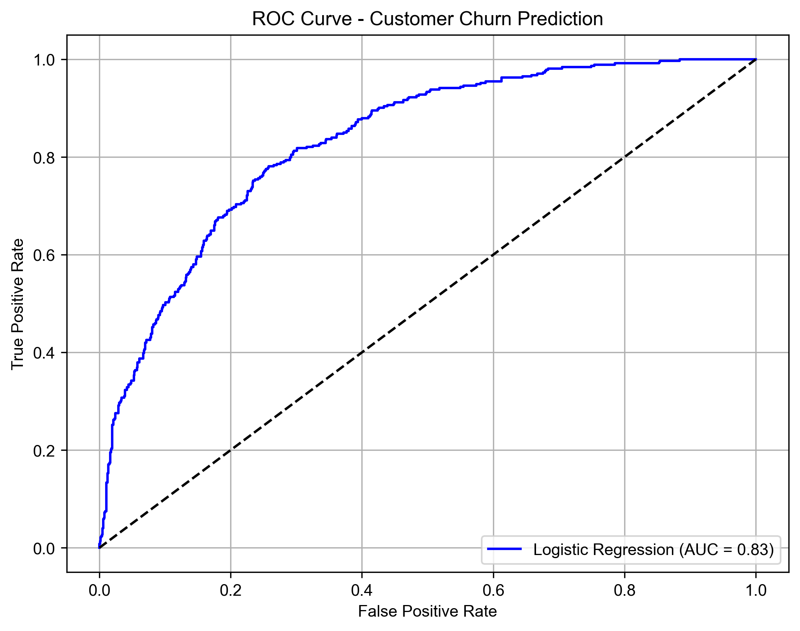

# Customer Churn Prediction with Logistic Regression

This project builds a machine learning model to predict customer churn based on the Telco Customer Churn dataset from Kaggle. The goal is to identify customers who are likely to leave, helping companies take preventive actions.

##  Tools Used
- Python (pandas, numpy, matplotlib, seaborn)
- scikit-learn (LogisticRegression, confusion matrix, ROC curve)
- Jupyter Notebook

##  Project Steps
1. Data Cleaning: Removed missing values from `TotalCharges`
2. Feature Engineering: One-hot encoding for categorical variables
3. Feature Scaling: Used StandardScaler
4. Model Building: Logistic Regression
5. Evaluation:
   - Accuracy: **79%**
   - AUC: **0.83**
   - Balanced F1-score for churn prediction: **0.56**

##  ROC Curve

##  Key Takeaways
- Churners are more likely to have month-to-month contracts and no tech support.
- Logistic regression is interpretable and performed well as a baseline model.
- Future improvements could involve Random Forest, XGBoost, and hyperparameter tuning.
